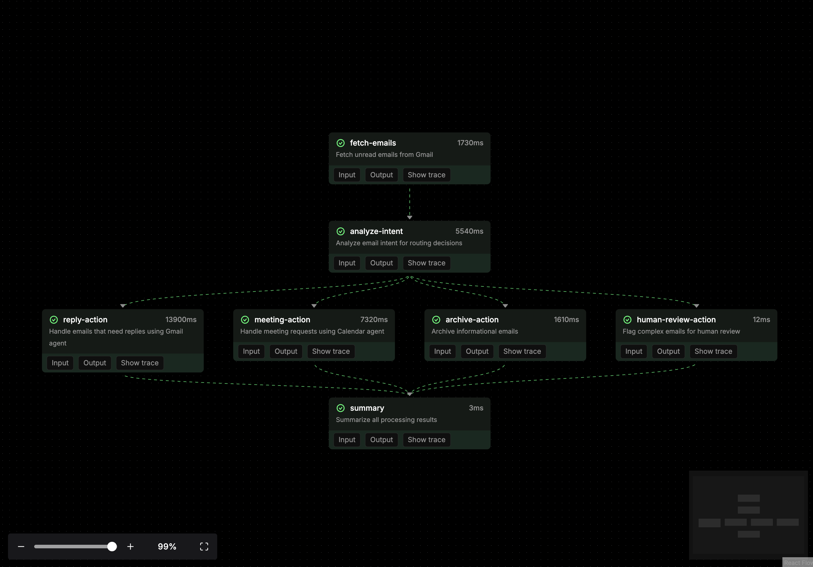
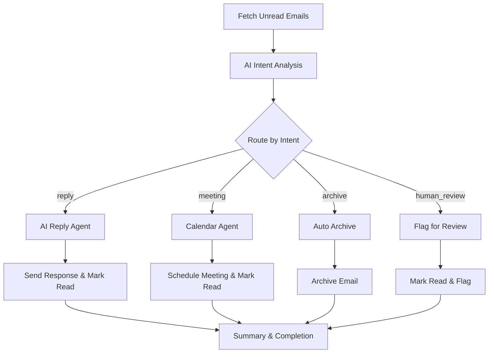

# Email AI Workflow



> **Intelligent Email Management System** - An AI-powered email automation solution built with [Mastra](https://mastra.ai) that automatically processes, categorizes, and responds to emails using Gmail API integration.

## 🎯 Project Goals

This project demonstrates how to build an intelligent email processing system that:

- **Automatically processes unread emails** using AI-powered intent analysis
- **Routes emails intelligently** based on content (replies, meetings, archives, human review)
- **Generates contextual responses** using AI agents
- **Manages calendar scheduling** for meeting requests
- **Handles email lifecycle management** (marking as read, archiving)
- **Provides human-in-the-loop capabilities** for complex emails

## 🏗️ How It Works

The system uses **Mastra workflows** to create a sophisticated email processing pipeline:



### Key Components:

1. **Intent Agent** (`intentAgent.ts`) - Analyzes email content using GPT-4 to classify intent
2. **Gmail Agent** (`gmailAgent.ts`) - Generates and sends professional email responses
3. **Calendar Agent** (`calendarAgent.ts`) - Handles meeting scheduling and calendar management
4. **Email Processing Workflow** (`emailProcessing.ts`) - Orchestrates the entire pipeline with parallel processing
5. **Gmail Tools** (`gmailTools.ts`) - Direct Gmail API integration for email operations

## ✨ Features

- 🤖 **AI-Powered Intent Classification** - Automatically categorizes emails as replies, meetings, archives, or human review
- 📧 **Smart Auto-Responses** - Generates contextually appropriate email replies using AI
- 📅 **Meeting Management** - Handles scheduling requests and calendar integration
- 🔄 **Parallel Processing** - Efficiently processes multiple emails simultaneously using branch-based routing
- 📊 **Comprehensive Logging** - Detailed workflow execution tracking and summaries
- 🔐 **Secure OAuth Integration** - Handles Google API authentication and token management
- 🎛️ **Configurable Processing** - Adjustable email batch sizes and processing limits

## 📋 Prerequisites

- **Node.js** ≥ 20.9.0
- **Google Cloud Project** with Gmail and Calendar APIs enabled
- **Gmail account** with appropriate permissions
- **pnpm/npm** for package management

## 🚀 Quick Setup

### 1. Install Dependencies

```bash
npm install
```

### 2. Google Cloud Setup

1. **Create Google Cloud Project**: Visit [Google Cloud Console](https://console.cloud.google.com/)
2. **Enable APIs**: Enable both Gmail API and Google Calendar API
3. **Create OAuth Credentials**:
   - Go to "APIs & Services" > "Credentials"
   - Click "Create Credentials" > "OAuth client ID"
   - Choose "Desktop application"
   - Download the JSON file

### 3. Configure Credentials

The project includes example credential files to help you get started:

```bash
# Copy the example files and replace with your actual credentials
cp credentials/gmail/credentials.json.example credentials/gmail/credentials.json
cp credentials/calendar/credentials.json.example credentials/calendar/credentials.json
```

Edit both files and replace the placeholder values with your actual Google Cloud OAuth credentials:
- `your-client-id.apps.googleusercontent.com` → Your actual client ID
- `your-google-cloud-project-id` → Your Google Cloud project ID
- `your-client-secret` → Your actual client secret

**💡 Tip**: You can use the same `credentials.json` for both Gmail and Calendar if they're from the same Google Cloud project with both APIs enabled.

### 4. Generate Authentication Tokens

Run the interactive token generator:

```bash
npm run generate-tokens
```

This script will:
- Guide you through OAuth consent flow
- Test API connections
- Generate `token.json` files for both services
- Validate authentication

### 5. Set Up Environment Variables

Copy the example environment file and configure your API keys:

```bash
# Copy the example file
cp .env.example .env

# Edit .env and replace the placeholder with your actual OpenAI API key
# OPENAI_API_KEY=sk-proj-your_openai_api_key_here
```

Get your OpenAI API key from: https://platform.openai.com/api-keys

## 🎮 Usage

### Run Email Processing Workflow

Process your unread emails with AI:

```bash
npm run workflow:email
```

This command:
1. Fetches unread emails (configurable limit)
2. Analyzes each email's intent using AI
3. Routes emails to appropriate handlers in parallel
4. Provides detailed processing summary

### Development Mode

Start the Mastra development server:

```bash
npm run dev
```

Then visit [http://localhost:4111/workflows](http://localhost:4111/workflows) to:
- Test workflows in the browser
- Monitor execution in real-time
- Debug workflow steps
- View workflow results and logs

### Manual Testing

Create custom test scripts like:

```typescript
import { mastra } from './src/mastra/index.js';

const workflow = mastra.getWorkflow('email-processing-workflow');
const run = await workflow.createRunAsync();

const result = await run.start({
  inputData: { maxEmails: 5 }
});

console.log(`Processed ${result.result.totalProcessed} emails`);
```

## 📁 Project Structure

```
src/mastra/
├── index.ts              # Main Mastra configuration
├── agents/
│   ├── intentAgent.ts    # Email intent classification
│   ├── gmailAgent.ts     # Email response generation
│   └── calendarAgent.ts  # Meeting scheduling
├── tools/
│   ├── gmailTools.ts     # Gmail API operations
│   └── calendarTools.ts  # Calendar API operations
├── workflows/
│   └── emailProcessing.ts # Main email workflow
└── types/
    └── email.ts          # TypeScript schemas

scripts/
├── generate-tokens.ts    # OAuth token generation
└── run-workflow.ts      # Workflow execution script

credentials/
├── gmail/
│   ├── credentials.json.example  # Gmail OAuth template
│   ├── credentials.json          # Your Gmail OAuth config (gitignored)
│   └── token.json               # Generated access token (gitignored)
└── calendar/
    ├── credentials.json.example  # Calendar OAuth template
    ├── credentials.json          # Your Calendar OAuth config (gitignored)
    └── token.json               # Generated access token (gitignored)

.env.example              # Environment variables template
.env                     # Your environment config (gitignored)
```

## 🔧 Workflow Deep Dive

### Email Processing Pipeline

The main workflow (`emailProcessing.ts`) implements a sophisticated branched processing system:

#### 1. **Email Fetching**
```typescript
fetchEmailsStep: Retrieves unread emails from Gmail
├── Configurable batch size (default: 5)
├── Filters for unread status
└── Extracts email metadata (subject, from, body, etc.)
```

#### 2. **Intent Analysis**
```typescript
analyzeIntentStep: AI-powered email classification
├── Uses GPT-4 for intelligent analysis
├── Categories: reply, meeting, archive, human_review
├── Provides reasoning for each classification
└── Handles analysis failures gracefully
```

#### 3. **Parallel Processing**
```typescript
Branched execution based on intent:
├── replyActionStep: AI response generation
├── meetingActionStep: Calendar management
├── archiveActionStep: Auto-archiving
└── humanReviewActionStep: Manual review flagging
```

#### 4. **Completion & Summary**
```typescript
summaryStep: Aggregates results and provides detailed reporting
```

### Agent Configuration

Each agent uses **OpenAI GPT-4o-mini** for efficient processing:

- **Intent Agent**: Lightweight classification with structured output
- **Gmail Agent**: Professional response generation with email tools
- **Calendar Agent**: Meeting time suggestions and event creation

### Tools Integration

**Gmail Tools** provide direct API access:
- `fetchUnreadEmailsTool`: Retrieves emails with full content parsing
- `sendEmailTool`: Sends replies with proper threading
- `markEmailAsReadTool`: Updates email status
- `archiveEmailTool`: Manages inbox organization

## 🐛 Troubleshooting

### Authentication Issues

**Problem**: "Missing authentication tokens"
```bash
# Solution: First copy example files, then generate tokens
cp credentials/gmail/credentials.json.example credentials/gmail/credentials.json
cp credentials/calendar/credentials.json.example credentials/calendar/credentials.json
# Edit the files with your actual Google Cloud credentials, then:
npm run generate-tokens
```

**Problem**: "Token expired" errors
```bash
# Tokens auto-refresh, but if issues persist:
rm credentials/*/token.json
npm run generate-tokens
```

**Problem**: "Missing credentials.json" errors
```bash
# Make sure you've copied and edited the example files:
ls -la credentials/*/credentials.json
# Should show both gmail and calendar credentials files
```

### API Quota Issues

**Problem**: Gmail API quota exceeded
- **Solution**: Reduce `maxEmails` in workflow configuration
- **Check**: Google Cloud Console > APIs & Services > Quotas

### Workflow Errors

**Problem**: Workflow fails during execution
- **Check**: Mastra dev server logs for detailed error information
- **Debug**: Use the web interface at `localhost:4111/workflows`
- **Verify**: OpenAI API key is configured if using custom agents

### Email Processing Issues

**Problem**: No emails being processed
- **Verify**: You have unread emails in your Gmail
- **Check**: Email filters aren't blocking the search query
- **Test**: API connection using `npm run generate-tokens`

## 🔄 Advanced Usage

### Custom Intent Categories

Modify `intentAgent.ts` to add custom email classifications:

```typescript
// Add new intent types
export const EmailIntentSchema = z.object({
  intent: z.enum(['reply', 'meeting', 'archive', 'human_review', 'urgent', 'newsletter']),
  reasoning: z.string(),
});
```

### Workflow Customization

Adjust processing parameters in `run-workflow.ts`:

```typescript
const result = await run.start({
  inputData: {
    maxEmails: 10,  // Process more emails
  },
});
```

### Integration Extensions

The project is designed for easy extension:
- Add new agents for specialized email types
- Create custom tools for external service integration
- Implement additional workflow steps for complex processing

---

**Built with [Mastra](https://mastra.ai)** - The TypeScript framework for AI workflows, agents, and tool orchestration.

For more advanced features and documentation, visit the [Mastra Documentation](https://docs.mastra.ai).